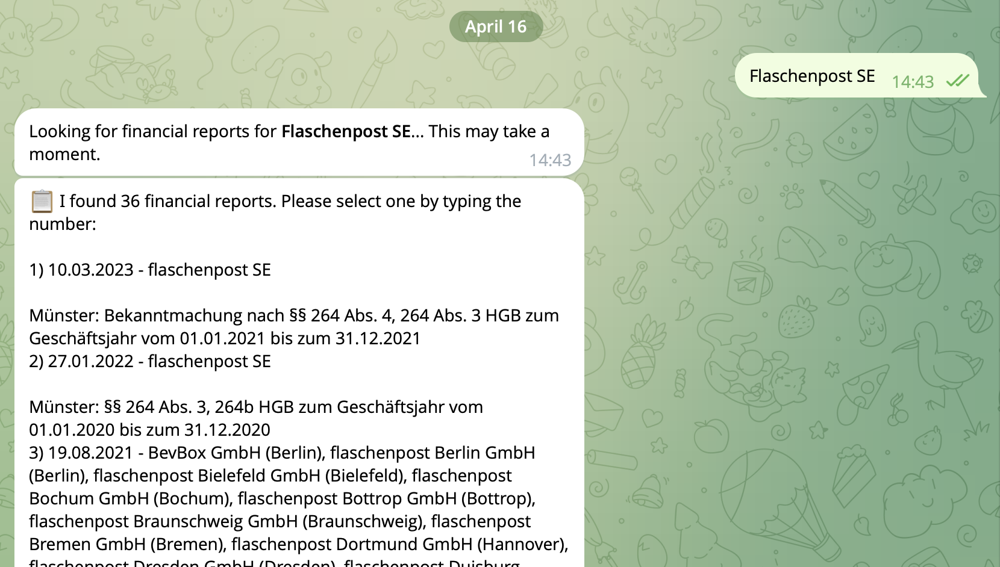
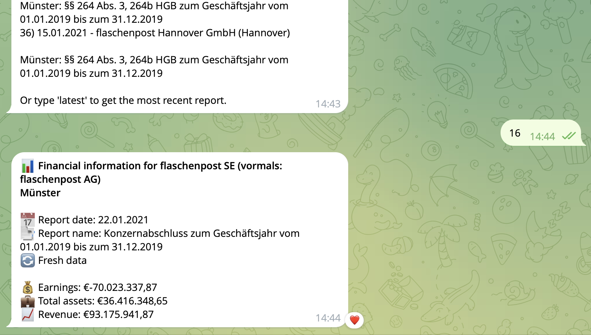

# 🇩🇪 Bundesanzeiger Financial Data Telegram Bot | German Company Financial Analysis

[](https://www.python.org/downloads/)
[](https://openai.com/)
[](https://core.telegram.org/bots/api)
[](https://opensource.org/licenses/MIT)

Extract, analyze and visualize financial data from German companies using the Bundesanzeiger (Federal Gazette) via a convenient Telegram bot interface with AI-powered financial analysis and visualization.

<p align="center">
  
  
</p>

## 📋 Table of Contents

- [Features](#features)
- [How It Works](#how-it-works)
- [Setup Instructions](#setup-instructions)
  - [Prerequisites](#prerequisites)
  - [Installation](#installation)
  - [Running Locally](#running-locally)
  - [Docker Deployment](#docker-deployment)
- [Usage](#usage)
  - [Example Commands](#example-commands)
  - [Timeline Analysis](#timeline-analysis)
- [Technical Details](#technical-details)
  - [Architecture](#architecture)
  - [Data Extraction](#data-extraction)
  - [Financial Analysis](#financial-analysis)
  - [Error Handling](#error-handling)
- [Troubleshooting](#troubleshooting)
- [Security Considerations](#security-considerations)
- [License](#license)
- [Contributions](#contributions)

## ✨ Features

- 🔍 **Advanced Company Search**: Find German companies in the Bundesanzeiger by name with fuzzy matching
- 💰 **Financial Data Extraction**: Automatically extract key financial metrics (earnings, total assets, revenue)
- 📊 **Financial Timeline Analysis**: Generate trend visualizations and performance graphs across multiple years
- 🤖 **Natural Language Processing**: OpenAI-powered understanding of financial reports and user queries
- 📱 **Telegram Interface**: User-friendly mobile access to complex financial data
- 💾 **Intelligent Caching**: High-performance data retrieval with automated caching system
- 🛡️ **CAPTCHA Handling**: Automatic solving of Bundesanzeiger CAPTCHA challenges
- 🌐 **Multi-Report Analysis**: Compare data across different financial periods

## 🔄 How It Works

1. Users send a company name to the Telegram bot
2. OpenAI's tool calling API extracts the company name from natural language input
3. The bot searches for the company in the Bundesanzeiger database
4. It retrieves and processes available financial reports
5. AI extracts structured financial data from complex German reports
6. The system generates visualizations and trend analysis
7. Formatted results and graphs are sent back to the user via Telegram

## 🚀 Setup Instructions

### Prerequisites

- Python 3.9+
- OpenAI API Key
- Telegram Bot Token (from @BotFather)
- Internet connection to access Bundesanzeiger

### Installation

1. Clone the repository:
   ```bash
   git clone https://github.com/yourusername/bundesanzeiger_telegram_bot.git
   cd bundesanzeiger_telegram_bot
   ```

2. Create a virtual environment:
   ```bash
   python -m venv venv
   source venv/bin/activate  # On Windows, use: venv\Scripts\activate
   ```

3. Install dependencies:
   ```bash
   pip install -r requirements.txt
   ```

4. Create a `.env` file with your credentials:
   ```
   # OpenAI API Key
   OPENAI_API_KEY=your_openai_api_key

   # Telegram Bot Configuration
   TELEGRAM_BOT_TOKEN=your_telegram_bot_token
   TELEGRAM_CHAT_ID=your_telegram_chat_id

   # Database Configuration (optional)
   DB_PATH=financial_cache.db
   ```

### Running Locally

Start the Telegram bot:

```bash
python scripts/telegram_bot.py
```

### Docker Deployment

#### Using Docker

1. Build the Docker image:
   ```bash
   docker build -t bundesanzeiger-bot .
   ```

2. Run the container:
   ```bash
   docker run -d --name bundesanzeiger-bot \
     -v $(pwd)/data:/app/data \
     --env-file .env \
     bundesanzeiger-bot
   ```

#### Using Docker Compose

1. Start the service:
   ```bash
   docker-compose up -d
   ```

2. View logs:
   ```bash
   docker-compose logs -f
   ```

## 📱 Usage

Once the bot is running, you can interact with it through Telegram:

1. Start a chat with your bot (using the bot username you set in @BotFather)
2. Send a message with a company name, e.g., `Deutsche Bahn AG` or `Show me financial data for BMW`
3. The bot will process your request and respond with the financial information

### Example Commands

- Send a company name: `Siemens AG`
- Ask a question: `What are the financials for Volkswagen?`
- Get help: `/help`

### Timeline Analysis

The bot can generate financial timelines with trend analysis and graphs. Available commands:

- Basic timeline: `timeline 10` - Analyze up to 10 most recent reports
- Select specific reports: `timeline 10 1,2,5,6` or `timeline 10 1-4`
- Filter by company name: `timeline 10 HolzLand Becker GmbH`
- Timeline for specific report: `2 timeline 10`

The bot will ask for confirmation before processing timeline analysis to prevent unwanted operations.

## 🔧 Technical Details

### Architecture

- `bundesanzeiger.py`: Handles scraping and processing of Bundesanzeiger data
- `telegram_bot.py`: Implements the Telegram bot interface
- `telegram_config.py`: Contains Telegram API configuration

### Data Extraction

The system uses BeautifulSoup for HTML parsing and extraction of financial data from the Bundesanzeiger website. It handles the site's session management, navigation structure, and Wicket components.

### Financial Analysis

Financial data is extracted using natural language processing to understand complex accounting terminology in German financial reports. The system identifies key financial indicators and normalizes them for trend analysis.

### Error Handling

The bot includes robust error handling for common issues:

- Not finding a company in the Bundesanzeiger database
- Connection issues with the Bundesanzeiger website
- Failed parsing of financial data
- CAPTCHA challenges from the Bundesanzeiger site

## ❓ Troubleshooting

### Common Issues

1. **Company Not Found**: 
   - The Bundesanzeiger database primarily contains German companies
   - Try using the full legal name (e.g., "BMW AG" instead of just "BMW")
   - Some smaller companies may not be required to publish financial reports

2. **Connection Issues**:
   - The Bundesanzeiger website may occasionally be down or block automated requests
   - Try using the `bundesanzeiger_selenium.py` backup implementation
   - Wait a few minutes and try again

3. **Missing Financial Data**:
   - Some companies may not have all financial metrics available
   - The report may use non-standard formats that are difficult to parse
   - Try requesting a different company

### Logging

For debugging, check the logs:

```bash
# When running locally
python scripts/telegram_bot.py

# When running with Docker
docker logs bundesanzeiger-bot
```

## 🔒 Security Considerations

- Keep your `.env` file secure and never commit it to version control
- Consider using Docker secrets for production deployments
- Regularly rotate your API keys
- The bot stores minimal user data and focuses on processing financial information

## 📄 License

This project is licensed under the MIT License - see the LICENSE file for details.

## 👥 Contributions

Contributions are welcome! Please feel free to submit a Pull Request or open an issue for bug reports and feature requests. 